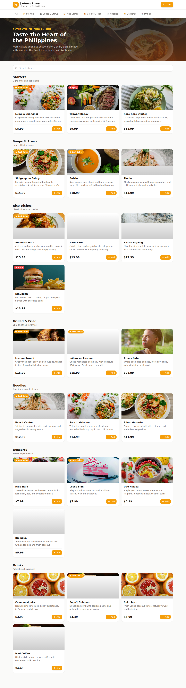

# Ordering UI (Blazor Server)

The customer-facing ordering UI, ported from the approved "Lutong Pinoy" design.
Built as Blazor Server interactive components. Owner: Christopher (UI).



## Run

```bash
dotnet run
```

Open the printed `http://localhost:<port>`. No database required yet — the menu is
served from an in-memory seed so the UI runs standalone.

## Structure

```
Components/
  App.razor              Host page (loads Tailwind via Play CDN + custom styles)
  Routes.razor           Router (default layout)
  Layout/MainLayout.razor
  Pages/
    Menu.razor           "/"            menu browsing + cart/checkout orchestration
    Confirmation.razor   "/confirmation" order placed + status tracker
    Error.razor
  Shared/
    Header.razor         sticky header + cart button (live total)
    CategoryFilter.razor sticky category pills
    MenuCard.razor       dish card with badges + qty stepper
    CartDrawer.razor     slide-in cart
    CheckoutModal.razor  customer details form
    Icon.razor           inline Lucide SVG icons
Models/                  MenuCategory, MenuItem, CartLine, Order, OrderItem, CheckoutDetails
Services/
  IMenuService           <-- backend seam
  IOrderService          <-- backend seam
  InMemoryMenuService    temporary seed (24 dishes, 7 categories)
  InMemoryOrderService   temporary in-memory order store
  CartState              per-session cart (scoped)
```

## Backend integration seam (for the SQL Server data layer)

The UI depends only on `IMenuService` and `IOrderService`. To plug in the
EF Core + SQL Server backend, implement those two interfaces and swap the
registrations in `Program.cs`:

```csharp
// builder.Services.AddSingleton<IMenuService, InMemoryMenuService>();
// builder.Services.AddScoped<IOrderService, InMemoryOrderService>();
builder.Services.AddScoped<IMenuService, SqlMenuService>();   // EF Core
builder.Services.AddScoped<IOrderService, SqlOrderService>(); // EF Core
```

The model classes in `Models/` mirror the original Supabase schema
(`menu_categories`, `menu_items`, `orders`, `order_items`), so the EF entities
can match field-for-field.

## Notes

- Tailwind is loaded via the Play CDN for a zero-build, exact-match port. Swap for
  a compiled Tailwind build before production.
- Prices display in `$` to match the original design. Switch to `₱` (PHP) later if desired.
